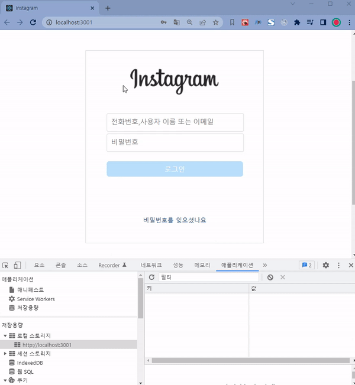

# 📡 react-Instagram-login

## 💁‍♂️ Introducing Project

> - React로 인스타그램 로그인을 만들어 봅시다.
> - 로그인 정보는 로컬 스토리지에 저장됩니다

## 🛠 Using Skill

> - React

## 🔧 How To Use?

#### start

```
npm install
```

## 👓 Screen

<p>로그인 정보를 입력, 입력 정보는 로컬스토리지에 저장</p>
<center>
  
</center>
